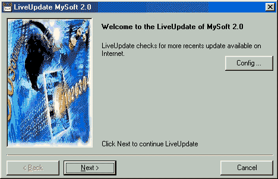



## LiveUpdate \*\* UPDATED \*\*

### Description

This application update your application with a FTP site, (like Norton).

The application compare the local and FTP date of the files and update only if FTP was more recent.

No component, no OCX, just API

You must See !!
 
### More Info
 

             |
---                |---
**Submitted On**   |2001-05-22 12:44:58
**By**             |[Robert Simard](https://github.com/Planet-Source-Code/PSCIndex/blob/master/ByAuthor/robert-simard.md)
**Level**          |Advanced
**User Rating**    |4.0 (36 globes from 9 users)
**Compatibility**  |VB 6\.0
**Category**       |[Files/ File Controls/ Input/ Output](https://github.com/Planet-Source-Code/PSCIndex/blob/master/ByCategory/files-file-controls-input-output__1-3.md)
**World**          |[Visual Basic](https://github.com/Planet-Source-Code/PSCIndex/blob/master/ByWorld/visual-basic.md)
**Archive File**   |[LiveUpdate199145222001\.zip](https://github.com/Planet-Source-Code/robert-simard-liveupdate-updated__1-23353/archive/master.zip)

